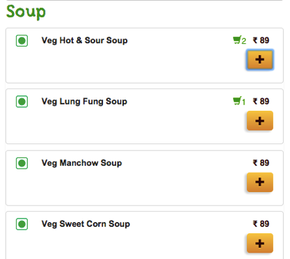

* Create Lab01.html file
* Add the react and babel scripts
* You have a javascript array like this

``` javascript
let cart = [
	{ "item": "Veg Hot & Sour Soup", "quantity": 1, "unitPrice": 89 },
	{ "item": "Veg Lung Fung Soup", "quantity": 1, "unitPrice": 89 },
	{ "item": "Veg Manchow Soup", "quantity": 1, "unitPrice": 89 },
	{ "item": "Veg Sweet Corn Soup", "quantity": 1, "unitPrice": 89 }		
];
```

* Use JSX and display it like this



* **Ignore the button actions; Don't focus too much on the styling part**