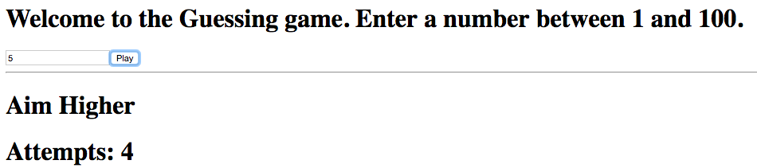

= Lab 01

[abstract]
In this lab you'll implement a guessing game(!!!) using Reducer hook. The objective is to write maintainable code.

* Please refer to the guessing game implemented in day07-react-states-props-app folder in the repository.
* The complete logic of the game should be in a reducer.

== Application
Have a look at the screenshot below. +

* Given below are some screenshots
* image:01.png[]
* image:02.png[]
* image:03.png[]
* image:04.png[]
* 

